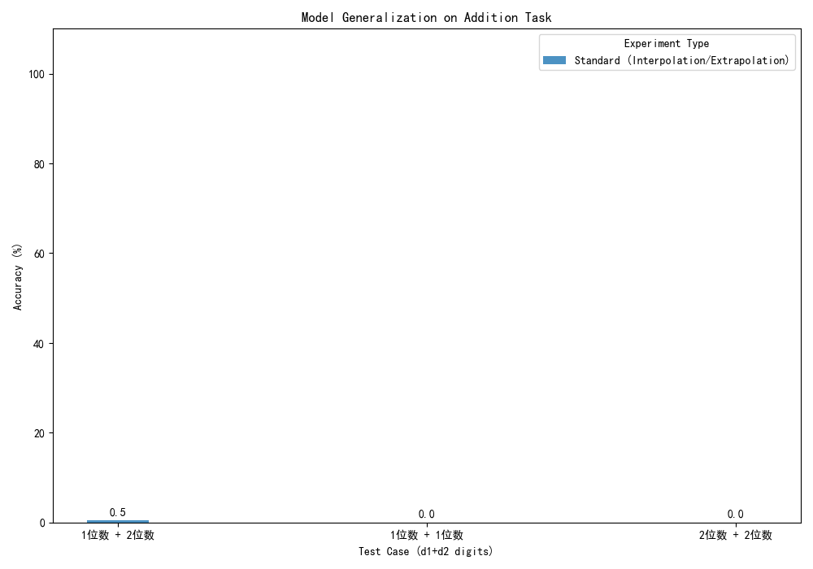
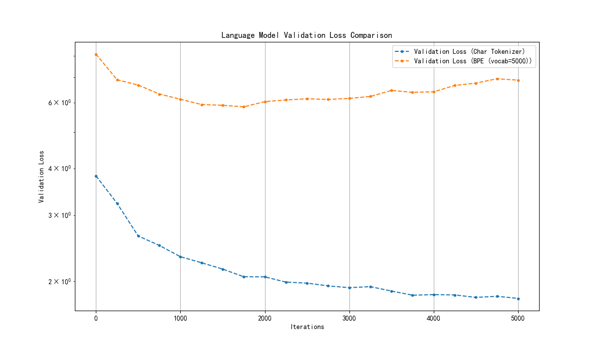

# FNLP-Task-3: 语言模型训练与加法运算任务

本项目包含两个核心的子任务，均基于Transformer架构：
1.  **语言模型 (Language Model)**: 在Wikitext数据集上训练一个自定义的语言模型，并使用不同的BPE分词器进行实验。
2.  **加法任务 (Addition Task)**: 训练一个Transformer模型来学习多位数的加法运算，并探索其在不同数据分布下的泛化能力。

## 目录结构

```
.
├── data/                   # 存放处理后的数据集 (如 wikitext-103-raw.txt)
├── models/                 # 存放训练好的模型权重 (.pth)
├── plots/                  # 存放训练过程中生成的图表 (损失曲线, 准确率对比图)
├── tokenizers/             # 存放训练好的BPE分词器模型 (.json)
├── config.py               # 语言模型的主要配置文件
├── data_utils.py           # 语言模型的数据处理和分词工具
├── model.py                # 语言模型的Transformer模型定义
├── prepare_dataset.py      # 下载并预处理Wikitext数据集的脚本
├── train.py                # 语言模型的训练脚本
├── generate.py             # 使用已训练的语言模型生成文本的脚本
├── addition_config.py      # 加法任务的配置文件
├── addition_data_utils.py  # 加法任务的数据生成和处理工具
├── addition_model.py       # 加法任务的Transformer模型定义
├── addition_main.py        # 加法任务的完整实验脚本 (训练、评估、绘图)
├── addition_generate.py    # 与加法模型进行交互式推理的脚本
└── plot_utils.py           # 用于绘制图表的通用工具
```

## 环境设置

1.  **克隆仓库**:
    ```bash
    git clone <your-repo-url>
    cd FNLP-Task-3
    ```

2.  **创建Python虚拟环境**:
    ```bash
    python -m venv venv
    source venv/bin/activate  # on Windows, use `venv\Scripts\activate`
    ```

3.  **安装依赖**:
    本项目依赖于PyTorch以及Hugging Face的`datasets`库等。请通过pip安装它们。
    ```bash
    pip install torch torchvision torchaudio
    pip install datasets tiktoken matplotlib numpy
    ```

---

## 子任务一：语言模型 (Language Model)

此任务的目标是训练一个能够生成连贯文本的语言模型。

### 步骤 1: 准备数据集

首先，运行脚本以下载并准备 `Wikitext-103` 数据集。数据将被保存在 `data/wikitext-103-raw.txt`。
```bash
python prepare_dataset.py
```

### 步骤 2: 训练模型

运行 `train.py` 脚本来训练语言模型。你可以通过修改 `config.py` 文件或设置命令行参数来调整训练配置，例如分词器类型和词汇表大小。

训练脚本会自动处理数据分词、模型构建、训练循环，并最终将训练好的模型保存在 `models/` 目录下，同时将分词器保存在 `tokenizers/` 目录下。

**示例：使用BPE分词器（词汇表大小为8000）进行训练**
```bash
# 确保在 config.py 中设置了 VOCAB_SIZE = 8000 和 TOKENIZER_TYPE = 'bpe'
python train.py
```
训练完成后，模型将保存为 `models/lm_BPE_vocab=8000.pth`。

### 步骤 3: 生成文本

使用 `generate.py` 脚本加载预训练的模型并生成文本。该脚本会依次加载 `models/` 目录下的多个模型配置，并展示它们的生成效果。
```bash
python generate.py
```

**生成结果示例**:
```
####################开始为实验BPE(vocab=8000)生成文本####################
--- 使用配置: Tokenizer=bpe, Vocab Size=8000 ---
加载模型
开始生成

--- 'BPE(vocab=8000)' 的生成结果 ---

It was a dark and stormy night, and the rain fell in torrents. The wind was howling, and the waves were crashing against the shore.
The old man sat by the fire, smoking his pipe. He had been a sailor all his life, and he had seen many storms. But this one was different.
This one was angry.
...
-------------------------------------------------------
```

---

## 子任务二：加法运算 (Addition Task)

此任务旨在探索Transformer模型是否能学习到加法运算的底层算法，并测试其在不同数字长度和组合上的泛化能力。

### 步骤 1: 运行完整的实验流程

`addition_main.py` 是一个集成的脚本，它会自动完成所有实验。具体包括：
1.  **为每个实验场景生成数据集**：
    *   `Comprehensive_Baseline`: 包含各种长度组合的基准测试。
    *   `Length_Interpolation`: 训练集有长度“间隙”，测试模型能否插值。
    *   `Symmetry_To_Asymmetry_Generalization`: 只在对称问题（如 `d+d`）上训练，测试能否泛化到非对称问题（如 `d1+d2`）。
2.  **训练模型**：为每个实验场景训练一个独立的Transformer模型。
3.  **评估模型**：在预设的测试集上评估每个模型的准确率。
4.  **保存结果**：将训练好的模型保存在 `models/` 目录，并将损失曲线和最终的准确率对比图保存在 `plots/` 目录。

**直接运行以下命令即可启动所有实验**:
```bash
python addition_main.py
```

### 步骤 2: 交互式推理

在实验运行完毕后，你可以使用 `addition_generate.py` 脚本与训练好的模型进行交互。该脚本会默认加载基准模型，并允许你输入加法问题。

```bash
python addition_generate.py
```

**交互示例**:
```
正在加载模型和分词器
模型加载成功

=====加法运算模型推理====
请输入一个加法问题, 或输入quit退出
问题:123 + 456
  模型的回答: 579
  正确的答案: 579
  结果: 正确

问题:9999 + 1
  模型的回答: 10000
  正确的答案: 10000
  结果: 正确
```

## 实验结果

训练完成后，相关的图表会自动保存在 `plots/` 目录下。

*   **加法任务损失曲线**: `plots/addition_loss_*.png`
*   **语言模型损失对比**: `plots/lm_loss_comparison.png`
*   **加法任务准确率对比**: `plots/addition_accuracy_comparison.png`



